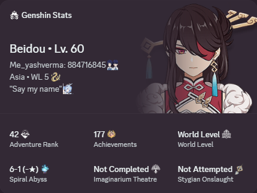
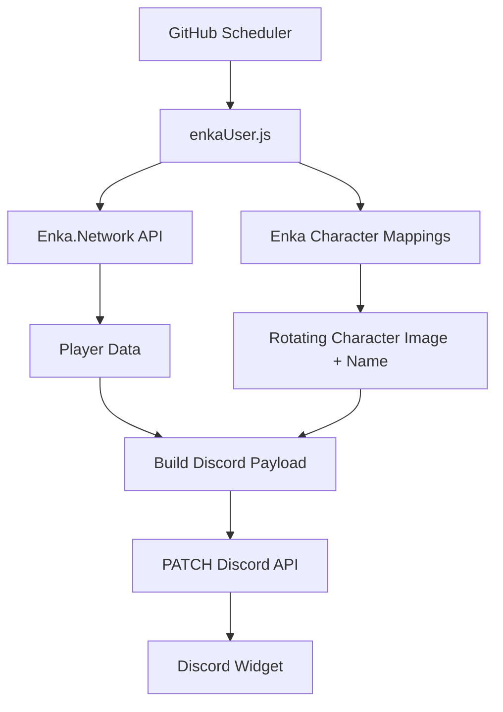

# 🎮 Discord Dynamic Genshin Profile Widget

<div align="center">
  
</div>

> **Real-Time Genshin Impact Discord Widget Automation powered by
> Enka.Network & GitHub Actions**

Automatically synchronize your public **Genshin Impact** profile with
Discord's **Dynamic Profile Widget** using **Enka.Network**,
**Node.js**, and **GitHub Actions**. No VPS, database, or always-on
server required.

------------------------------------------------------------------------


------------------------------------------------------------------------

## 📸 Preview

<p align="center">
  
</p>

------------------------------------------------------------------------

## ✨ Overview

This project fetches your public player profile from Enka.Network,
converts it into Discord's Dynamic Widget payload format, and
automatically updates your Discord profile on a schedule.

### ✅ Features

-   🎮 Adventure Rank
-   🌍 Region & World Level
-   🏆 Achievements
-   ⚔️ Spiral Abyss Progress
-   🎭 Imaginarium Theatre Progress
-   💀 Stygian Onslaught Progress
-   ✍️ Player Signature
-   🖼️ **Rotating character showcase** — a different showcased
    character's portrait every few hours
-   🏷️ Character name & level label (e.g. `Beidou • Lv. 60`)
-   ⚡ Fully automated updates via GitHub Actions

### 🏗 Infrastructure

-   GitHub Actions
-   Node.js
-   Discord Widget API
-   Enka.Network API
-   REST API Automation

> ✅ No VPS\
> ✅ No server\
> ✅ No database\
> ✅ Runs entirely on GitHub Actions

------------------------------------------------------------------------

## 🖼️ Character Rotation

Every scheduled run picks a character from your **in-game showcase**
and displays their portrait and name on the widget.

``` txt
+0h   → Beidou • Lv. 60
+6h   → Xingqiu • Lv. 60
+12h  → Heizou • Lv. 60
+18h  → Diluc • Lv. 60
 ...cycles through your entire showcase, then repeats
```

**How it works:**

-   The rotation slot is derived from the current time
    (`Date.now() / ROTATE_HOURS`), so no state file or database is
    needed — each 6-hour window maps to the next showcase slot.
-   Character icons and names come from
    [Enka.Network's official mappings](https://github.com/EnkaNetwork/API-docs)
    (`characters.json` + `loc.json`), so **new characters are supported
    automatically** — nothing to maintain.
-   Costume icons are used when a costume is equipped, and the Traveler
    is handled correctly via skill-depot suffixes.
-   If your showcase is empty, it falls back to your in-game profile
    picture.

**Change the rotation speed** with the `ROTATE_HOURS` environment
variable (default `6`). If you rotate faster than the workflow
schedule, also update the cron so the workflow runs at least as often:

``` yaml
schedule:
  - cron: "0 */3 * * *"   # every 3 hours
env:
  ROTATE_HOURS: 3
```

To change which characters appear, just reorder or swap the characters
in your **in-game showcase** (Profile → Edit → Character Showcase) and
make sure **"Show Character Details"** is enabled.

------------------------------------------------------------------------

## 🚀 Setup

### 1. Fork this repository

### 2. Create a Discord Application

### be advised that this requires knowing what you're doing, along with browser devtools knowledge!
2.1 Go to the [Discord Developer Portal](https://discord.com/developers/applications).
> the warning only applies if you are manually creating your widget!
- 2.1.a. use this [widget creation script](https://gist.github.com/aamiaa/7cdd590e3949cd654758bc90bcb4710b) by aamia (automatic). 
- 2.1.b. if you want to manually go thru the creation process, follow the steps in this [blog post](https://chloecinders.com/blog/discord-widgets) by chloecinders to create your discord application, social sdk profile and widget design.
2.  Copy the **Application ID** (`DISCORD_CLIENT_ID`) and the
    **Bot Token** (`DISCORD_BOT_TOKEN`).
3.  Create your **Dynamic Profile Widget** and bind the fields listed
    in [Widget Fields](#-widget-fields) below.

### 3. Add GitHub Secrets

**Repository → Settings → Secrets and variables → Actions → New repository secret**

| Secret              | Value                       |
|---------------------|-----------------------------|
| `GENSHIN_UID`       | Your 9-digit Genshin UID    |
| `DISCORD_CLIENT_ID` | Discord Application ID      |
| `DISCORD_USER_ID`   | Your Discord User ID        |
| `DISCORD_BOT_TOKEN` | Discord Bot Token           |

### 4. Run it

Open **Actions → Update Genshin Widget → Run workflow**. After the
first successful run, it updates automatically every 6 hours.

**Local development:**

``` bash
npm install
cp .env.example .env   # fill in your values
node enkaUser.js
```

------------------------------------------------------------------------

## 🧩 Widget Fields

Bind these field names in your Discord widget design:

| Field       | Type   | Example                        |
|-------------|--------|--------------------------------|
| `nickname`  | Text   | Me_Yashverma                   |
| `uid`       | Text   | UID 884716845                  |
| `world`     | Text   | Asia • WL 9                    |
| `adv_str`   | Text   | Adventure Rank                 |
| `adv`       | Number | 60                             |
| `ach_str`   | Text   | Achievements                   |
| `ach`       | Text   | 1427                           |
| `aby_str`   | Text   | Spiral Abyss                   |
| `aby`       | Text   | 12-3 (36★)                     |
| `img_str`   | Text   | Imaginarium Theatre            |
| `img`       | Text   | Act 8 (10★)                    |
| `sty_str`   | Text   | Stygian Onslaught              |
| `sty`       | Text   | Diff 6 • 214s                  |
| `sig`       | Text   | "May all the beauty be blessed."|
| `world_str` | Text   | World Level                    |
| `mini`      | Text   | Yash: AR 60                    |
| `image`     | Image  | Rotating character portrait    |
| `char`      | Text   | Beidou • Lv. 60                |

------------------------------------------------------------------------

## 🏗 System Architecture



------------------------------------------------------------------------

## ⚙️ How It Works

1.  GitHub Actions triggers on schedule or manually.
2.  `enkaUser.js` fetches your profile from Enka.Network.
3.  The rotation slot is computed from the current time and a
    showcased character is selected.
4.  The character's icon and localized name are resolved from
    Enka's official mapping files.
5.  Everything is transformed into a Discord widget payload.
6.  Discord API receives a PATCH request.
7.  Your widget updates automatically.

------------------------------------------------------------------------

## 🌐 APIs Used

### Enka.Network

``` text
https://enka.network/api/uid/{UID}?info
```

Character/name mappings (maintained by Enka.Network):

``` text
https://raw.githubusercontent.com/EnkaNetwork/API-docs/master/store/characters.json
https://raw.githubusercontent.com/EnkaNetwork/API-docs/master/store/loc.json
https://raw.githubusercontent.com/EnkaNetwork/API-docs/master/store/pfps.json
```

### Discord Widget API

``` http
PATCH https://discord.com/api/v9/applications/{APP_ID}/users/{USER_ID}/identities/0/profile
```

------------------------------------------------------------------------

## 📦 Example Payload

``` json
{
  "data": {
    "dynamic": [
      { "type": 1, "name": "nickname", "value": "Me_Yashverma" },
      { "type": 1, "name": "uid", "value": "UID 884716845" },
      { "type": 1, "name": "world", "value": "Asia • WL 9" },
      { "type": 2, "name": "adv", "value": 60 },
      { "type": 1, "name": "ach", "value": "1427" },
      { "type": 1, "name": "char", "value": "Beidou • Lv. 60" },
      {
        "type": 3,
        "name": "image",
        "value": { "url": "https://enka.network/ui/UI_AvatarIcon_Beidou.png" }
      }
    ]
  }
}
```

------------------------------------------------------------------------

## 🤖 GitHub Actions

Workflow:

``` text
.github/workflows/update.yml
```

Schedule:

``` yaml
schedule:
  - cron: "0 */6 * * *"
```

Manual execution is also supported via **Run workflow**.

> ℹ️ GitHub scheduled runs can be delayed a few minutes under load;
> the rotation self-corrects since the slot is derived from the clock,
> not from the previous run.

------------------------------------------------------------------------

## 📂 Project Structure

``` text
Genshin-Stats/
├── enkaUser.js
├── package.json
├── .env.example
├── preview.png
└── .github/
    └── workflows/
        └── update.yml
```

------------------------------------------------------------------------

## 🛠️ Troubleshooting

| Problem | Fix |
|---------|-----|
| `Player profile is private or not found` | Enable **Show Character Details** in your in-game profile settings and wait a few minutes. |
| Discord API `401` | Bot token is wrong or regenerated — update the `DISCORD_BOT_TOKEN` secret. |
| Discord API `403 / 404` | Check `DISCORD_CLIENT_ID` and `DISCORD_USER_ID`; the widget must be created under the same application. |
| Image not showing | Ensure your widget design has an **Image** element bound to the `image` field. |
| Same character every run | Your showcase may have only one character, or the workflow isn't running on schedule — check the Actions tab. |
| `Cannot find module 'dotenv'` | Run `npm install` first. |

------------------------------------------------------------------------

## 🧰 Tech Stack

-   Node.js
-   GitHub Actions
-   Axios
-   Discord API
-   Enka.Network API

------------------------------------------------------------------------

## 📚 References

-   https://enka.network/
-   https://github.com/EnkaNetwork/API-docs
-   https://discord.com/developers/docs
-   https://docs.github.com/actions
-   https://chloecinders.com/blog/discord-widgets#setting-up-your-application-and-developer-portal
-   https://github.com/toastylol/Genshin-Stats

------------------------------------------------------------------------

## ⭐ Contributing

Issues and pull requests are welcome. If you build upon this project,
please consider giving the repository a ⭐.
